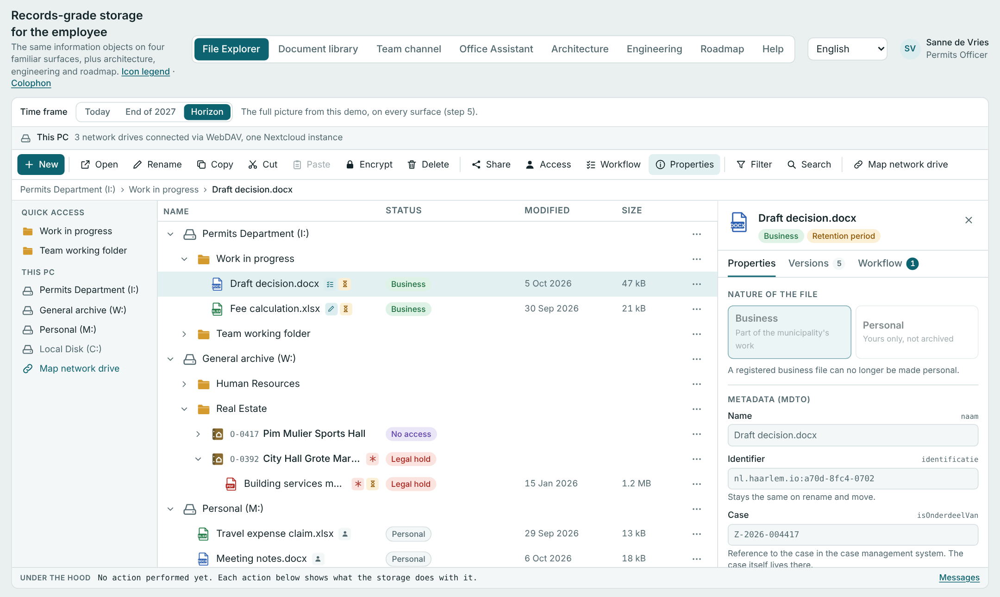
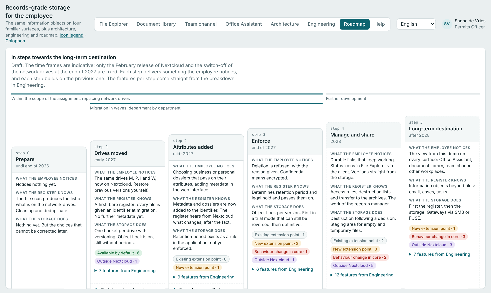
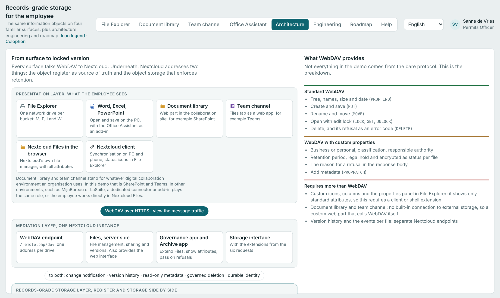

# Revisionssichere Speicherung für Beschäftigte

[English](README.md) · [Nederlands](README.nl.md) · **Deutsch**

**▶ [Demo öffnen](https://eha-1999.github.io/XENA/#de)** · auch auf [English](https://eha-1999.github.io/XENA/#en) · [Nederlands](https://eha-1999.github.io/XENA/#nl) · [Français](https://eha-1999.github.io/XENA/#fr) · [Español](https://eha-1999.github.io/XENA/#es) · [Italiano](https://eha-1999.github.io/XENA/#it) · [Polski](https://eha-1999.github.io/XENA/#pl)

Eine interaktive Demo, die zeigt, wie souveräne, revisionssichere Dateiablage auf **Nextcloud** und **S3-Objektspeicher** für Beschäftigte einer Kommunalverwaltung aussieht. Aufbewahrungsfristen, Legal Hold, Metadaten und Zugriffsregeln werden im Hintergrund durchgesetzt, während die Beschäftigten in den Oberflächen weiterarbeiten, die sie bereits kennen.



> **Eine Demo, kein Produkt.** Alle Beispieldaten sind erfunden: Personen, Akten und Vorgangsnummern existieren nicht. Die Demo zeigt das Zielbild; der Schalter *Zeitraum* und die Ansicht *Roadmap* zeigen, was wann verfügbar wird.

---

## Ausprobieren

Öffnen Sie `index.html` in einem Browser. Es ist eine einzige, eigenständige Datei: keine Installation, kein Build-Schritt, kein Server.

Oder online öffnen: **[https://eha-1999.github.io/XENA/](https://eha-1999.github.io/XENA/)**. Mit einem Sprachcode öffnet sie sich in dieser Sprache, zum Beispiel `https://eha-1999.github.io/XENA/#en`.

## Was die Demo zeigt

| Ansicht | Was Sie sehen |
|---|---|
| **Explorer** | Der Datei-Explorer auf dem PC mit den Laufwerken M:, P:, I: und W:. Jedes Laufwerk ist ein Bucket in einer einzigen Nextcloud-Umgebung. |
| **Dokumentbibliothek** | Die Dateiliste auf einer Teamwebsite, zum Beispiel SharePoint, mit Spalten für Klassifikation und Aufbewahrung. |
| **Teamkanal** | Die Registerkarte Dateien in einem Teamkanal, zum Beispiel Teams. Wählbar sind die Kanaldateien oder ein verbundenes Laufwerk. |
| **Office-Assistent** | Ein Add-in für Office-Pakete, hier in Word gezeigt: Merkmale, Vorschläge, Barrierefreiheit und Workflow neben dem Dokument. Derselbe Aufbau funktioniert in LibreOffice und anderen Paketen: eine dünne Zwischenschicht, je Paket ein kleines Add-in. |
| **Architektur** | Wie Oberflächen, Nextcloud, Register und Objektspeicher zusammenhängen, mit Beispielen für WebDAV- und S3-Nachrichten. |
| **Technik** | Je Funktion, was sie von Nextcloud verlangt: Standard, Erweiterungspunkt, Kernänderung oder etwas außerhalb von Nextcloud. |
| **Roadmap** | In sechs Schritten von den Netzlaufwerken zum Zielbild, mit Meilensteinen und Entscheidungspunkten. |
| **Hilfe** | Funktionen, warum die Kombination zählt, häufige Fragen, Begriffe und eine Anleitung für Administratoren. |

Die Leiste unten (*Unter der Haube*) zeigt bei jeder Aktion, welche Nachricht an den Speicher geht.

## Wichtigste Funktionen

- **Arbeiten mit Dateien:** Dateien, Ordner und Akten anlegen; öffnen, umbenennen, kopieren, ausschneiden und einfügen; im Suchindex des Registers suchen; nach Merkmalen filtern.
- **Schriftgutverwaltung:** dienstlich oder persönlich, Metadaten nach MDTO (dem niederländischen Metadatenstandard für Archivgut), Akten, die Klassifikation und Aufbewahrungsfrist weitergeben, Aufbewahrungsfrist durchgesetzt mit S3 Object Lock, Legal Hold.
- **Irrtümer korrigieren:** eine Widerrufsfrist nach der Registrierung; bei gesperrten Objekten das Unlesbarmachen des Inhalts durch Vernichten des Schlüssels (Crypto-Shredding).
- **Versionen:** frühere Versionen ansehen und wiederherstellen; das Wiederherstellen erzeugt eine neue Version.
- **Teilen und Zugriff:** dauerhafte Links über Register und Resolver; drei Berechtigungen (Lesen, Bearbeiten, Verwalten) je Person oder Gruppe; Sichtbarkeit (auffindbar oder verborgen), festgelegt von der verantwortlichen Stelle des Objekts; Zugriffsanfragen.
- **Zusammenarbeit:** Sperre „In Verwendung durch“ bei Desktop-Anwendungen; gemeinsames Bearbeiten im Browser-Editor; ein Workflow-Bereich je Objekt.
- **Zeitraum:** zwischen *Heute*, *Ende 2027* und *Zielbild* wechseln, um zu sehen, was wann vorhanden ist.
- **Echter WebDAV-Server:** in der eigenständigen Datei einen echten Server verbinden (siehe unten).

## Warum diese Kombination

Jede der drei Komponenten gibt es bereits. Zusammen in einem Speicher sind sie selten, und erst zusammen lösen sie das Problem öffentlicher Verwaltungen:

1. **Revisionssichere Speicherung.** Der Speicher setzt Aufbewahrungsfrist und Legal Hold selbst durch, je Version. Ohne das bleibt Revisionssicherheit ein Versprechen einer Anwendung.
2. **Funktionen der Schriftgutverwaltung.** Metadaten, Akten, Versionen, Zugriffsregeln und Workflow geben jeder Datei den Kontext, um sie für eine Informationsanfrage wiederzufinden, zu veröffentlichen oder verantwortungsvoll zu vernichten.
3. **Integration in vertraute Oberflächen.** Ohne diese Integration bleiben Dateien auf den alten Laufwerken und in Postfächern liegen.

Auf selbst betriebenem Speicher mit Open Source und mit einer Kennung, die unabhängig von der Plattform ist, behält die Verwaltung die Hoheit über ihre Informationen auch bei der nächsten Migration. Der Ansatz ergänzt Common Ground: Das Vorgangsbearbeitungssystem bleibt für Vorgänge maßgeblich, dieser Speicher übernimmt alle anderen Dokumente.



## Sprachen

Die Demo ist auf Niederländisch, Deutsch, Englisch, Französisch, Spanisch, Italienisch und Polnisch verfügbar. Alle Übersetzungen sind in `index.html` enthalten.

- Die Sprache folgt dem Browser; oben rechts wählen Sie eine andere.
- Mit einem Rautezeichen verlinken Sie direkt auf eine Sprache, zum Beispiel `index.html#de` oder `index.html#fr`.
- Die Auswahl wird im Browser gespeichert (`localStorage`).

Die Übersetzungen wurden mit Sorgfalt für die Fachterminologie erstellt, aber nicht von Muttersprachlern geprüft. Korrekturen sind willkommen.

## Einen echten WebDAV-Server verbinden

In der eigenständigen Datei akzeptiert *Netzlaufwerk verbinden* auch die Adresse eines echten WebDAV-Servers, mit Benutzername und Passwort. Durchsuchen und Öffnen funktionieren, und Anlegen, Umbenennen, Ordner erstellen und Löschen **geschehen wirklich auf diesem Server**; Löschen ist endgültig. Die Archivfunktionen (Metadaten, Aufbewahrungsfristen, Akten) sowie Kopieren, Ausschneiden und Einfügen sind dort deaktiviert. Verwenden Sie einen Testserver mit Testdaten.

Der Browser erlaubt das nur, wenn der Server es zulässt (CORS) und sein Zertifikat vertrauenswürdig ist. Die Hilfe (*Für Administratoren*) beschreibt zwei saubere Wege:

1. Die Seite vom selben Server ausliefern wie das WebDAV-Laufwerk (gleiches Schema, gleicher Host, gleicher Port). CORS spielt dann keine Rolle.
2. Den Server CORS-Header senden lassen, die vorgeschaltete `OPTIONS`-Anfrage ohne Anmeldung beantworten und Header-Namen ohne Beachtung der Groß- und Kleinschreibung lesen.

Innerhalb von claude.ai funktioniert die Verbindung nicht, weil Seiten dort keine Verbindungen nach außen aufbauen dürfen.

## Architektur und Roadmap in Kürze

- **Präsentationsschicht:** Explorer, Office-Pakete (Word, LibreOffice und andere) mit dem Office-Assistenten, Dokumentbibliothek, Teamkanal, Nextcloud Files im Browser, Nextcloud-Client.
- **Nextcloud:** WebDAV-Endpunkt, Files, eine Governance- und Archiv-App, die Speicherschnittstelle.
- **Revisionssichere Schicht:** Objektregister, Resolver und Schlüsselverwaltung neben S3-Objektspeicher mit Versionierung, Object Lock und Legal Hold; ein Bucket je Laufwerk.
- **Sechs Anforderungen an Nextcloud:** Änderungsbenachrichtigung, delegierte Versionshistorie, schreibgeschützte Metadaten aus dem Register, gesteuerte Löschung, dauerhafte Identität und von der Datei zum Informationsobjekt. Nur Anforderung 3 und 4 gehören zum aktuellen Auftrag.
- **Zugriffssteuerung:** jetzt Rollen (RBAC); in Schritt 4 zentrale Richtlinien, die in Zugriffsregeln in Nextcloud übersetzt werden; im Zielbild ein zentraler Entscheidungspunkt je Anfrage (PBAC).



## Technische Hinweise

- Eine HTML-Datei mit reinem JavaScript und CSS. Kein Framework, keine Abhängigkeiten, kein Build.
- Die einzige externe Anfrage ist die Schrift IBM Plex von Google Fonts. Ohne sie greift der Browser auf eine Systemschrift zurück.
- Hell- und Dunkelmodus folgen dem Betriebssystem.
- Die Demo hält alles im Arbeitsspeicher: Was Sie anlegen, bleibt bis zum Neuladen der Seite erhalten.

## Aufbau des Repositorys

```
index.html                  die Demo
README.md                   englische Fassung
README.nl.md                niederländische Fassung
README.de.md                diese Datei
docs/                       Bildschirmfotos für die README
```

## Mitwirkende

Erstellt von **Erik Hoekstra**, Programmarchitekt und Senior Consultant, Abteilung i-Ontwikkeling, Gemeinde Haarlem, mit Unterstützung von Claude Opus 5.5 (Anthropic).

Erstellt für das Gespräch mit Nextcloud über revisionssichere Speicherung, das Common-Ground-Team und den Verbund OWC sowie Beschäftigte, Records Manager und Architekten der Gemeinden Haarlem und Zandvoort.

Kontakt: [ehoekstra@haarlem.nl](mailto:ehoekstra@haarlem.nl) · [erik@erikhoekstra.com](mailto:erik@erikhoekstra.com)

## Lizenz

© 2026 Gemeinde Haarlem. Frei nutzbar, veränderbar und weiterverbreitbar unter der [European Union Public Licence (EUPL) 1.2](https://interoperable-europe.ec.europa.eu/collection/eupl/eupl-text-eupl-12). Siehe `LICENSE`.
